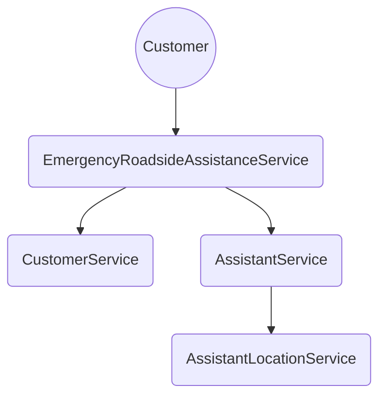

# ERAS

This is a C# .NET 6 console app that excercises a simple ERA service.
It was written and built using Visual Studio 2022.

## To build:

```
dotnet clean
dotnet build
```

## To run:

```
cd ./RoadsideAssistanceApp
dotnet run
```

It implements the required interface, which calls 3 other services: Customer, Assistant, and AssistantLocation.



I split this up because in a real-world scenario this would most likely be multiple services using different backing stores.  For example, I would have implemented the AssistantLocationService using a geospatially indexed database.

To replicate basic functionality of a geospatially indexed database, I am using the great-circle distance forumla to calculate the distance in kilometers between two latitude/longitude pairs.

## Testing

The console app will load 1000 locations around the US using the included cities.json file.  It will then choose 1000 random locations on each run and assign 1000 assistants to those locations.

**Note:** I am assuming that it is desirable to include assistants that are equidistant to the customer in the "find nearest assistants" call, and am thus including them in the SortedSet.

### Test 1

A simulated customer located in Grand Forks, ND will be used to find the 5 closest assistants.

### Test 2

All the assistants are cleared, and 4 assistants are added in the following locations:

* Moorhead, MN
* Fargo, ND
* Grand Forks, ND
* Grand Forks, ND

As there are only 4 assistants, asking for the top 5 will show just the top 4 including equidistant assistants.

### Test 3

This shows that a customer can reserve the closest assistant, and that assistant will no longer be returned in futher calls to find the closest assistant.

### Test 4
This will show that a customer cannot reserve another assistant without releasing the currently reserved assistant.

### Test 5

This will add 4 more customers to the mix, and then have each try to reserve the 3 remaining assistants.  The last customer cannot reserve any as there are no assistants available.

### Test 6

This shows that the original customer can release the reserved assistant, making it available to the last customer to reserve.